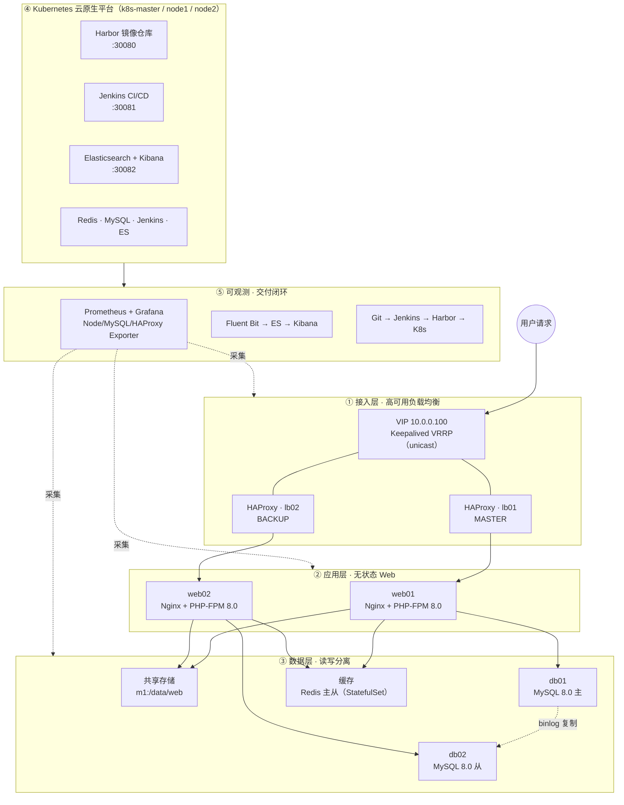

<p align="center">
  
  
  
  
  
</p>

<h1 align="center">OpsLab · 运维全栈实战项目</h1>

<p align="center"><b>从「裸机」到「云原生」——在 11 台 VMware 虚拟机上，从零搭建高可用 Web 集群，再容器化、再迁上 Kubernetes，并打通 CI/CD、监控、日志三大闭环。</b></p>

---

## 一句话定位

一个**可展示、可面试、可复现**的全栈运维实验室：不依赖云厂商，用本地 VMware + Rocky Linux 从零搭起一套生产形态的 Web 技术栈，并用 Ansible、Docker、Kubernetes 逐步自动化，最终沉淀为「文档即简历、踩坑即亮点」的工程仓库。

三大核心能力：

| 能力 | 含义 | 落地 |
|---|---|---|
| **高可用** | 单点故障不影响服务 | Keepalived VRRP + HAProxy + NFS + MySQL 主从 |
| **可交付** | 一次提交，自动上线并可回滚 | Git → Jenkins → Harbor → K8s 滚动更新 |
| **可观测** | 出问题能定位 | Prometheus + Grafana、Fluent Bit → ES → Kibana |

---

## 架构全景



> 更完整的 ASCII 三版架构演进见 [docs/architecture.md](docs/architecture.md)。

---

## 三阶段演进

### 阶段一 · 传统高可用集群（已部署 ✅）

| 层 | 技术 | 作用 |
|---|---|---|
| 负载均衡 | HAProxy + Keepalived（VRRP unicast） | `10.0.0.100` VIP 漂移，lb01 故障自动切 lb02 |
| Web | Nginx + PHP-FPM 8.0 | 动态页面 + 反向代理 |
| 存储 | NFS v4（m1 提供 `/data/web`） | web01/web02 共享站点目录，无状态水平扩展 |
| 数据库 | MySQL 8.0 主从 | binlog 复制，应用层读写分离（写主读从） |
| 缓存 | Redis 主从 | session 共享 + 热点缓存 |

### 阶段二 · 容器化（Docker）

- `docker/Dockerfile`：多阶段构建 PHP 应用镜像
- `docker/docker-compose.yml`：本地一键编排
- 把「环境」抽象成「镜像」，交付物从代码变成可复现的镜像

### 阶段三 · Kubernetes 云原生（已部署 ✅）

- **Harbor** 私有镜像仓库（NodePort 30080）
- **Jenkins** CI/CD（NodePort 30081），Pipeline 构建推送镜像触发滚动更新
- **Redis / MySQL** 用 StatefulSet 承载有状态服务；K8s 中间件全部通过 NodePort 对 VM 暴露
- **ConfigMap / Secret** 管理配置与密码，**Ingress** 预留 Harbor HTTPS 入口

---

## 三大核心闭环

**① 请求链路（可用）**：用户 → VIP → HAProxy → Nginx → （MySQL 主从 / Redis / NFS），单一组件故障由 Keepalived、主从、共享存储兜底。

**② 交付链路（上线）**：`Git 提交 → Jenkins 构建镜像 → 推送 Harbor → kubectl 滚动更新 → rollout 状态`，支持快速回滚。

**③ 可观测链路（定位）**：
- 指标：node-exporter / HAProxy / MySQL exporter → Prometheus → Grafana（`10.0.0.17:3000`）
- 日志：Fluent Bit DaemonSet → Elasticsearch → Kibana（`10.0.0.18:30082`）

---

## 虚拟机拓扑（11 台 · Rocky Linux 9.8）

| 节点 | IP | 规格 | 角色 |
|------|------|------|------|
| m1 | 10.0.0.10 | 1C / 1G | 管理机（Ansible + NFS 服务端） |
| lb01 | 10.0.0.11 | 1C / 1G | HAProxy + Keepalived（MASTER） |
| lb02 | 10.0.0.12 | 1C / 1G | HAProxy + Keepalived（BACKUP） |
| web01 | 10.0.0.13 | 1C / 2G | Nginx + PHP-FPM |
| web02 | 10.0.0.14 | 1C / 2G | Nginx + PHP-FPM |
| db01 | 10.0.0.15 | 1C / 2G | MySQL 主库 |
| db02 | 10.0.0.16 | 1C / 2G | MySQL 从库 |
| monitor | 10.0.0.17 | 2C / 4G | Prometheus + Grafana |
| k8s-master | 10.0.0.18 | 2C / 4G | K8s Control Plane + Harbor |
| k8s-node1 | 10.0.0.19 | 2C / 4G | Worker（Redis 主 + Jenkins + Harbor Core） |
| k8s-node2 | 10.0.0.20 | 2C / 4G | Worker（Redis 从 + ES + Kibana + Harbor DB） |

> 网段 `10.0.0.0/24` · 网关 `10.0.0.2` · 账号 `root/opsuser` 密码 `123456`（仅实验环境，生产请替换）

---

## 技术栈

| 分类 | 技术 |
|------|------|
| 操作系统 | Rocky Linux 9.8、systemd、firewalld、SELinux |
| 负载均衡 | HAProxy、Keepalived（VRRP unicast） |
| Web 服务 | Nginx、PHP-FPM 8.0 |
| 存储 | NFS v4、local-path（K8s PVC） |
| 数据库 | MySQL 8.0（主从复制、读写分离） |
| 缓存 | Redis（K8s StatefulSet 主从） |
| 自动化 | Ansible（inventory / playbooks） |
| 监控 | Prometheus、Grafana、node / MySQL / HAProxy Exporter |
| 容器 | Docker、containerd、Harbor |
| 编排 | Kubernetes 1.31（kubeadm + Flannel CNI） |
| 中间件 | Jenkins、Elasticsearch、Kibana、Fluent Bit |
| CI/CD | Jenkins Pipeline（k8s agent） |

---

## 仓库结构

```
auto-ops/
├── README.md                     # 项目门面（架构 / 技术栈 / 使用说明）
├── LICENSE                       # MIT 开源协议
├── Makefile                      # 常用任务统一入口（make help 查看）
├── .editorconfig                 # 跨编辑器编码与缩进统一
├── ansible/                      # inventory + playbooks（7 阶段自动化部署）
├── scripts/                      # Shell 运维脚本（备份 / 部署 / 健康检查 / K8s 引导）
├── configs/                      # haproxy、keepalived、nginx、mysql、php-fpm、prometheus 配置
├── app/                          # 示例应用（index.php + health.php，含输入校验与容错）
├── docker/                       # Dockerfile + docker-compose + nginx/supervisord
├── k8s/                          # K8s YAML 全集 + Helm values（含 Harbor/Redis/Jenkins/ES/Kibana）
├── cicd/                         # Jenkinsfile（声明式 Pipeline）
└── docs/                         # 文档即简历
    ├── architecture.md           # 架构演进：传统 → 容器 → K8s
    ├── 01-foundation/ … 07-cicd/ # 每阶段一篇：做了什么 / 踩坑 / 验证
    └── troubleshooting/          # ★ 真实故障演练记录（面试亮点）
```

---

## 快速开始

```bash
# 1. 克隆仓库
git clone git@github.com:liuc04467-gif/auto-ops.git
cd auto-ops

# 2. 查看主机清单
cat ansible/hosts.ini

# 3. 传统架构部署（在 m1 上执行）
ansible-playbook ansible/init_servers.yml
ansible-playbook ansible/lb_setup.yml
ansible-playbook ansible/web_setup.yml
ansible-playbook ansible/db_setup.yml
ansible-playbook ansible/monitor_setup.yml

# 3'. 或使用统一部署入口（等价于上面的分步执行）
./scripts/deploy.sh all

# 4. K8s 集群部署
ansible-playbook -i ansible/hosts.ini ansible/k8s_setup.yml
ssh root@10.0.0.18 'bash /root/init_master.sh'
ssh root@10.0.0.19 'bash /root/join_worker.sh 10.0.0.18 <token> <ca_hash>'
ssh root@10.0.0.20 'bash /root/join_worker.sh 10.0.0.18 <token> <ca_hash>'

# 5. K8s 中间件一键 apply（顺序见 k8s/README.md）
kubectl apply -f k8s/redis_master_slave.yaml
kubectl apply -f k8s/jenkins.yaml
kubectl apply -f k8s/es_kibana.yaml
helm install harbor harbor/harbor -n harbor --create-namespace -f k8s/harbor-values.yaml

# 6. 日常运维可用 make 简化操作
make help          # 查看所有任务
make check         # 健康检查
make backup DB=opslab
```

---

## 访问入口

| 服务 | 地址 | 账号 |
|------|------|------|
| Web 应用 | http://10.0.0.100/index.php | - |
| 数据库读写测试 | http://10.0.0.100/db_test.php | - |
| HAProxy 状态页 | http://10.0.0.100:8404/stats | admin / admin123 |
| Prometheus | http://10.0.0.17:9090 | - |
| Grafana | http://10.0.0.17:3000 | admin / admin |
| Harbor（K8s） | http://10.0.0.18:30080 | admin / Harbor12345 |
| Jenkins（K8s） | http://10.0.0.18:30081 | admin / 见 k8s/README |
| Kibana（K8s） | http://10.0.0.18:30082 | 无（xpack.security=false） |

---

## 验证

```bash
# HAProxy 负载均衡轮询
curl http://10.0.0.100/index.php

# MySQL 主从（写主读从实时同步）
curl http://10.0.0.100/db_test.php

# Prometheus 采集目标
curl http://10.0.0.17:9090/api/v1/targets

# K8s 节点与 Pod
kubectl get nodes
kubectl get pods -A
```

---

## 运维脚本

`scripts/` 下所有脚本统一遵循：`set -euo pipefail` 严格模式、结构化日志（INFO/WARN/ERROR）、白名单输入校验、依赖预检与显式退出码。

| 脚本 | 用途 | 关键特性 |
|------|------|----------|
| `scripts/backup.sh` | MySQL 逻辑备份 + 过期清理 | 库名白名单、失败清理、GTID 兼容、非空校验 |
| `scripts/deploy.sh` | 按阶段运行 Ansible playbook | 阶段白名单、声明式映射、依赖预检、多阶段组合 |
| `scripts/check.sh` | 集群健康检查 | 拓扑可配置、超时控制、汇总退出码（0/1） |
| `scripts/harbor-tls.sh` | Harbor 自签证书 + K8s Secret | 域名/命名空间校验、幂等写入 |
| `scripts/es-snapshot.sh` | Elasticsearch 快照备份 | 保留天数校验、参数经环境变量注入 |
| `scripts/fix_cni_plugins.sh` | 修复 CNI 插件缺失 | 版本校验、镜像源自动切换、完整性校验 |
| `scripts/join_worker.sh` | K8s Worker 加入集群 | token/ca-hash 格式校验、containerd 就绪等待 |
| `scripts/init_master.sh` | K8s master 控制平面初始化 | 变量校验、分段日志、显式退出码 |
| `scripts/setup_repo.sh` | 仓库骨架引导（历史脚本） | 幂等提示、目标目录校验 |

---

## 工程实践

- **输入校验**：脚本对所有参数/环境变量做白名单与类型校验（库名、域名、token、IP、版本号等）；`app/index.php` 对注入配置做主机名/库名白名单校验，杜绝 DNS/DSN 注入。
- **错误处理**：统一 `set -euo pipefail` + `trap` 失败清理 + 结构化日志；健康检查逐项独立并汇总退出码，可接入告警/CI。
- **安全**：密码优先经环境变量 / `.my.cnf` / K8s Secret 注入，仓库不落明文密钥（`.gitignore` 排除 `*.key/*.pem/*.crt/.env`）；PHP 输出统一 HTML 转义防 XSS。
- **一致性**：统一脚本头注释、日志函数、目录结构；`.editorconfig` 锁定编码与缩进；`Makefile` 提供统一任务入口。
- **可维护性**：声明式映射（deploy.sh 的阶段 → playbook）、幂等操作（harbor-tls 先删后建、备份失败自动清理）。

---

## 故障演练（面试亮点）

每一个真实踩坑都沉淀为文档，见 [docs/troubleshooting/](docs/troubleshooting/)：

| # | 故障 | 关键排查 |
|---|------|---------|
| 01 | VM 安装后循环进安装界面 | 弹光驱 + `bios.bootOrder` |
| 02 | `Reached target Basic System` 黑屏 | 去掉 `crashkernel` / `quiet` |
| 03 | VRRP 多播脑裂 | VMware NAT 不支持多播 → 改 unicast |
| 04 | MySQL 主从同步中断 | 跳过错误 + `START REPLICA` |
| 05 | Root SSH 被拒（Rocky 9） | `PermitRootLogin yes` |
| 06 | K8s 中间件故障合集 | setup/teardown、RBAC、Harbor DB、Kibana OOM、socket |

> 后续真实报错请追加到 [docs/troubleshooting/error-log.md](docs/troubleshooting/error-log.md)。

---

## 技能矩阵

| 方向 | 覆盖点 |
|------|--------|
| Linux | Rocky 9、systemd、firewalld、SELinux |
| 网络 | NAT、VRRP、VIP、unicast、TCP/IP |
| 自动化 | Ansible（inventory / playbooks） |
| 负载均衡 | HAProxy、Keepalived、健康检查 |
| Web | Nginx、PHP-FPM、NFS |
| 数据库 | MySQL 8.0、binlog 复制、读写分离 |
| 缓存 | Redis 主从（StatefulSet） |
| 监控 | Prometheus、Grafana、各类 Exporter |
| 容器 / 编排 | Docker、containerd、Harbor、Kubernetes |
| CI/CD | Jenkins Pipeline |
| 日志 | Fluent Bit、Elasticsearch、Kibana |
| 工程化 | Shell 校验、Ansible 幂等、容器多阶段构建、配置管理 |

---

## License

[MIT](LICENSE)

## 作者

**liuchongyang** · [GitHub](https://github.com/liuc04467-gif)
